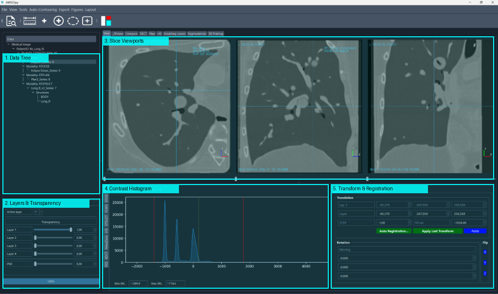

# User Guide

Welcome to the AMIGOpy User Guide. This section will walk you through the core workflows of loading data, navigating the interface, and performing image analysis.

---

## Loading Data

AMIGOpy provides several flexible methods to load your medical images, 3D structures, dose distributions, and CAD/3D printing models.

**Method 1: Windows Explorer Integration (Recommended)**
You can launch AMIGOpy and load entire datasets directly from Windows Explorer:
* **Loading a Folder**: Right-click any folder containing your dataset in Windows Explorer, select **Open with**, and choose **AMIGOpy**. AMIGOpy will launch and automatically scan and load all files recursively inside that folder.
* **Loading Individual or Grouped Files**: Select a single `.dcm` (DICOM) file, or select a group of files, right-click, select **Open with**, and choose **AMIGOpy**.

**Method 2: Drag and Drop**
With the AMIGOpy interface already open, you can drag and drop folders or individual files directly from Windows Explorer into the **Data Tree** panel on the left side of the window to load them.

**Method 3: Top Navigation Menu**
You can open files from the top menu by going to **File ➔ Open** and selecting your desired format. 

AMIGOpy supports various keyboard shortcuts to open standard formats:
* **DICOM** (`Ctrl + D`) — Select a folder, and AMIGOpy will recursively load all DICOM slices, RTDoses, RTStructs, and RTPlans inside.
* **NIfTI** (`Ctrl + N`) — Open NIfTI volumetric data (`.nii`, `.nii.gz`).
* **AMIGOpy** (`Ctrl + A`) — Open native workspace files.
* **IrIS** (`Ctrl + I`) — Open IrIS formats.

---

## Navigating the Interface

Once your data is loaded, the interface displays the volumetric views and analysis panels:

*Figure 1: The AMIGOpy main interface layout, with numbered annotations matching the panels below.*

**1. Data Tree (Left Panel)**
All loaded items are organized in the hierarchical Data Tree menu on the left side (marked as **1** on the interface diagram):
* Grouped by format (e.g., `Medical Image` ➔ `DICOM`).
* Organized by **PatientID**, **StudyID**, **Modality** (e.g., `CT`, `RTDOSE`, `RTSTRUCT`, `RTPLAN`), and **Series**.
* Under `RTSTRUCT`, you can expand and view individual contoured structures (e.g., `BODY`, `Lung_R`).

**2. Layers & Transparency Panel (Bottom-Left)**
Located directly below the Data Tree (marked as **2** on the interface diagram):
* Controls active visualization layers (supporting up to 4 concurrent image layers).
* Individual transparency sliders to blend slices and structures seamlessly.

**3. Slice Viewports (Top Panels)**
The main display features three orthogonal slice rendering viewports (marked as **3** on the interface diagram):
* **Axial view** (Transverse) — left pane.
* **Sagittal view** — middle pane.
* **Coronal view** — right pane.
Each view contains position lines indicating cross-sectional alignment and slider controls below the viewports to page through slices.

**4. Contrast Histogram (Bottom-Center Panel)**
The histogram panel at the bottom center plots the distribution of Hounsfield Units (HU) or voxel intensities in the loaded scan (marked as **4** on the interface diagram):
* The graph helps visualize the image contrast.
* The red vertical dotted lines indicate the current window boundaries.
* You can adjust the **Min WL** and **Max WL** values using the text inputs below the plot to adjust contrast windowing manually.

**5. Transform & Registration Panel (Bottom-Right)**
Located at the bottom right corner (marked as **5** on the interface diagram):
* Translation and rotation inputs to manual align scans.
* **Auto Registration** trigger buttons (for intensity-based mutual alignment of multiple datasets).

---

## Mouse Controls in Slice Views

Interact with the viewports using your mouse:
* **Window & Level**: Left-click and hold inside any slice view, then drag the mouse to dynamically adjust the contrast Window (width) and Level (center).
* **Zooming**: Right-click and hold, then drag up/down to zoom in or out on the slice.
* **Panning (Dragging)**: Click and hold the mouse wheel (middle click), then drag the mouse to pan the image around the viewport.
